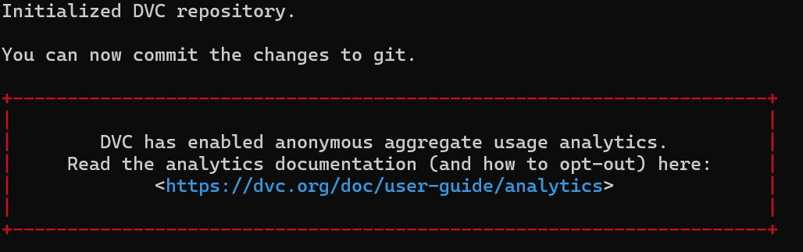
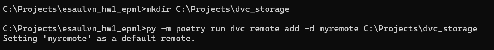
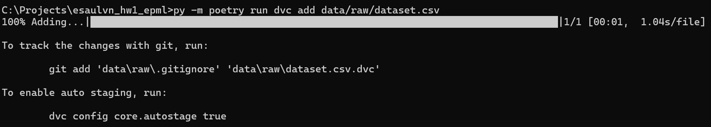
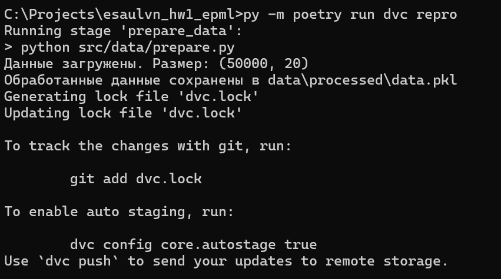
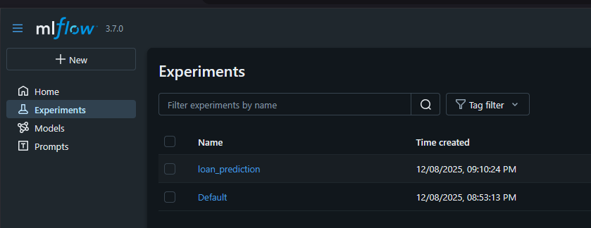
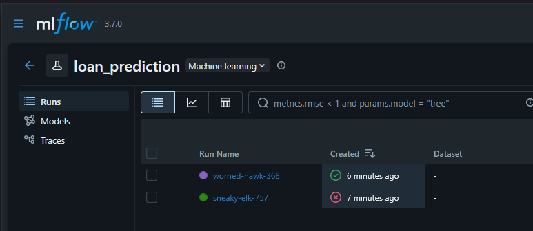
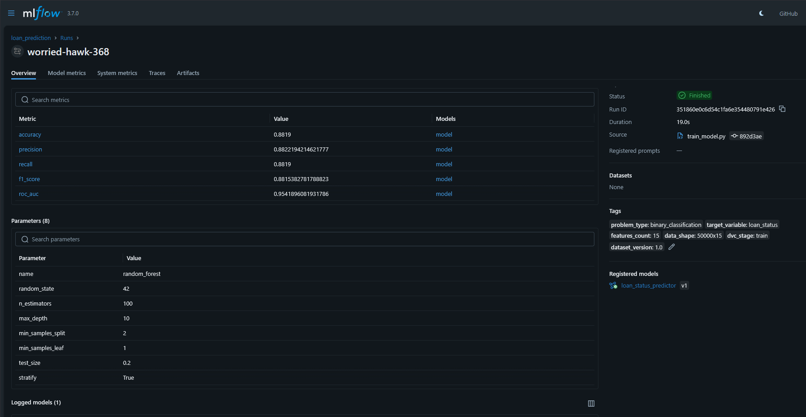
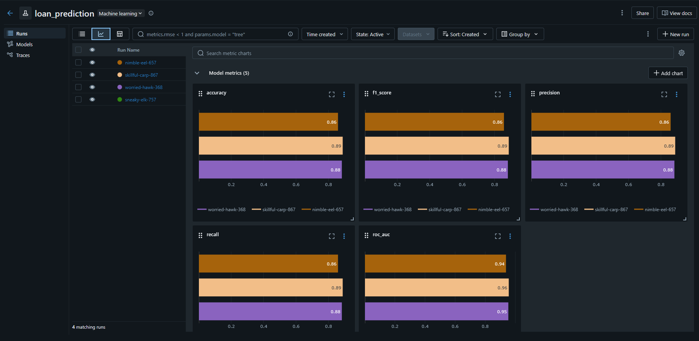

esaulvn_hw1_epml
==============================


# Настройка DVC:

*   Добавлены данные из датасета с kaggle ([Loan Approval Prediction](https://www.kaggle.com/datasets/parthpatel2130/realistic-loan-approval-dataset-us-and-canada)) в папку data/raw
*   С помощью poetry установлен и запущен dvc, .dvc .dvcignore добавлены в репозиторий
```
py -m poetry run dvc init
```


*   Настроено remote storage (Local)



*   Создан файл с версией датасета и добавлен в репозиторий



```
git add data/raw/dataset.csv.dvc .gitignore
git commit -m "Add dataset.csv via DVC"
```

*   Запушены данные в локальное хранилище через 
```
py -m poetry run dvc push
```

*   Создан dvc.yaml для версионирования датасета. Запуск через
```
py -m poetry run dvc repro
```


# Настройка MLFlow:

*   Установлен MLFlow, создан файл params.yaml с параметрами модели, в файл с пайплайном dvc добавлена часть с обучением модели
*   В файл train_model.py добавлен трекинг экспериментов через MLFlow и сохранение артефактов 

* После запуска Mlflow через
```
py -m poetry run mlflow server --backend-store-uri sqlite:///mlflow.db --default-artifact-root ./mlruns --host localhost
```
и запуска пайплайна c обработкой данных и обучением модели через
```
py -m poetry run dvc repro
```
можно увидеть результаты эксперимента в MLFlow






*   и сравнение метрик при изменении параметров 



* Плюс папка mlruns с инфо о запусках пайплайна добавлена в gitignore

# Воспроизводимость:

*   Инструкции по воспроизведению
1. Клонировать репозиторий
```
git clone --branch hw_2 https://github.com/yourusername/enginiring-practices-ml.git
cd enginiring-practices-ml
```

2. Задать создание виртуального окружения внутри проекта в poetry, установить все зависимости
```
py -m poetry config virtualenvs.in-project true --local
py -m poetry install
py -m poetry install --with dev
```

3. Получить данные из dvc
```
py -m poetry run dvc pull
```

4. В новом терминале перейти в папку репозитория. Запустить MLflow UI для просмотра экспериментов через poetry
```
py -m poetry run mlflow ui --backend-store-uri sqlite:///mlflow.db --default-artifact-root ./mlruns --host localhost
```
Открыть http://localhost:5000

4. Воспроизвести пайплайн с теми же или измененными параметрами в params.yaml
```
py -m poetry run dvc repro
```

6. Для запуска в контейнере запустить MLFlow, далее запустить скрипт с обучением
```
docker-compose up -d mlflow
docker-compose run --rm train python src/models/train.py
```

# Отчет о проделанной работе:
*   Создан отчет в формате Markdown
