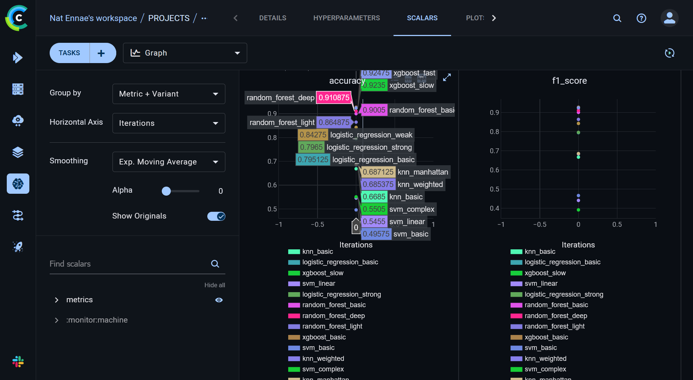
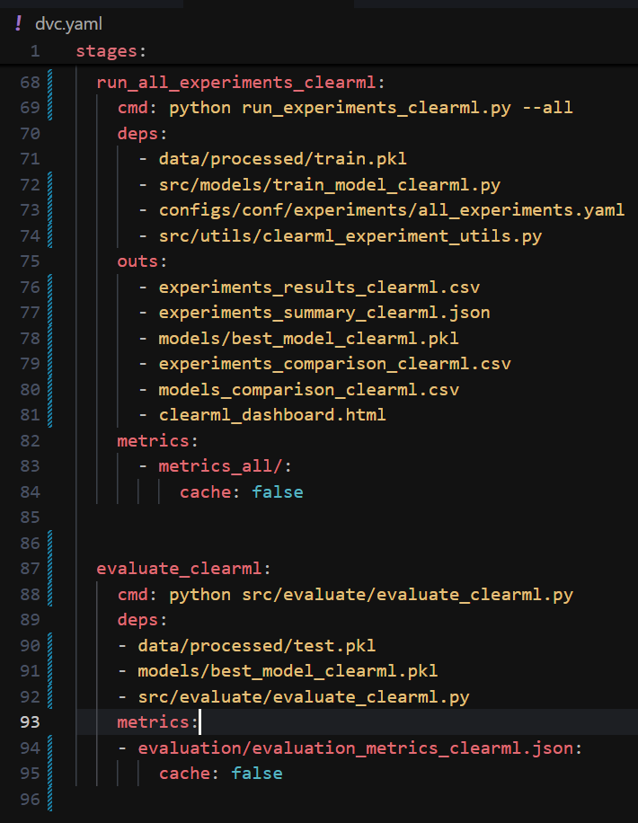
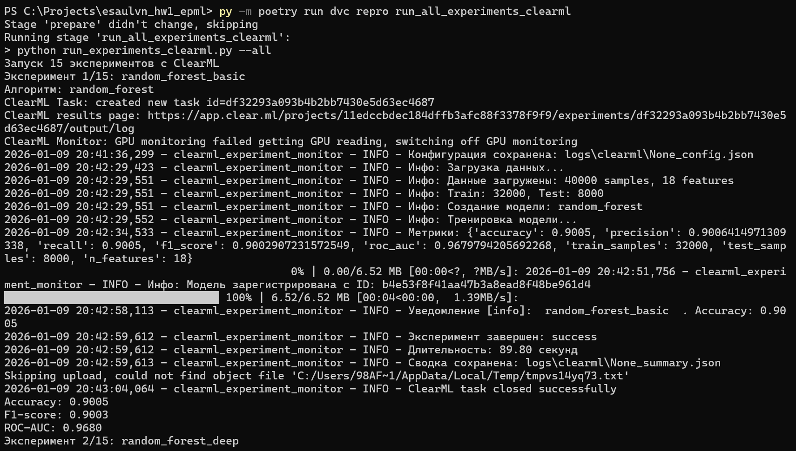

esaulvn_hw4_epml
==============================

# Настройка ClearML:

* Работа с облачной версией, после регистрации на app.clear.ml и введения значений ключей из воркспейс окружение настроено

```
py -m poetry run pip install clearml
py -m poetry run clearml-init
```


креды сохранены в файле clearml.conf в локальной папке

* Создан workflow для ML пайплайна с 4 этапами
    - подготовка данных
    - проведение эксперимента с Hydra
    - проведение всех экспериментов
    - оценка наилучшей модели на тестовых данных


* Настроeны зависимости между этапами через deps в dvc.yaml 
* Настроено кэширование в dvc.yaml, запустить параллельное выполение можно через

```
py -m poetry run src/utils/parallel_execution.py
```

# Трекинг экспериментов:

* Настроено автоматическое логирование событий, производительности метрик и параметровв файле scr/utils/clearml_monitor.py

* Создана система сравнения экспериментов с тегами, привязками к моделям, и с логированием результатов


* Эксперименты можно сравнивать в интерфейсе ClearML, выбрав необходимые для сравнения



# Управление моделями:

* Настроена регистрация и версионирование моделей, с добавлением метаданных моделей в clearml. Также модели сохраняются локально


* Модели можно сравнивать в интерфейсе ClearML, выбрав необходимые для сравнения


# Пайплайны (2 балла):

* Созданы ClearML пайплайны для ML workflow в dvc.yaml



* Создана система мониторинга выполнения и настроены уведомления в scr/utils/clearml_monitor.py



# Отчет о проделанной работе:

Создан отчет в формате Markdown