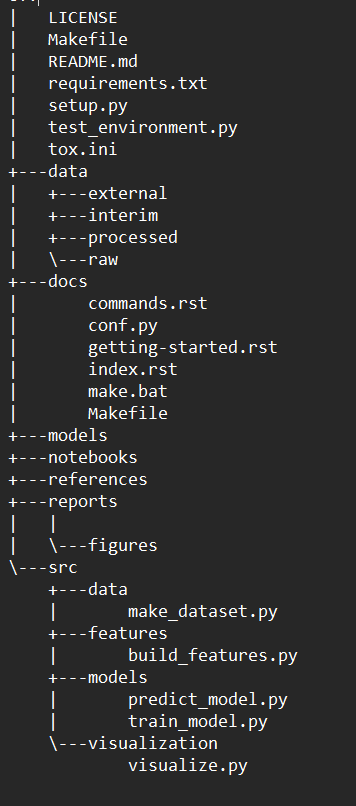
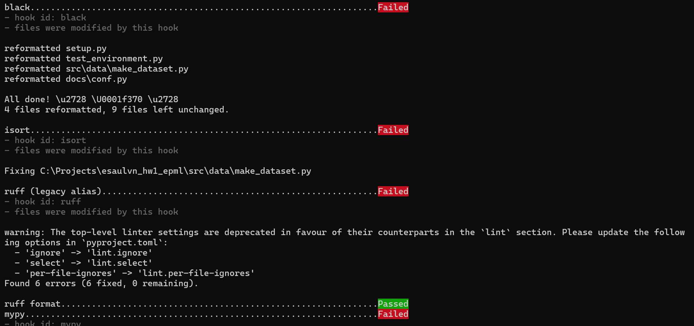

esaulvn_hw1_epml
==============================

# Структура проекта:

*   Создана структура папок с помощью Cookiecutter, проект настроен, создан README с описанием проекта
* Cкриншот структуры без служебных файлов:




# Качество кода и управление зависимостями:
*   Через pip установлены pre-commit и все необходимые инструменты для пре-коммит хуков
*   Создан yaml файл для Black, isort, Ruff, MyPy, Bandit
*   Создан файл pyproject с конфигурацией этих инструментов
*   Проверена работа хуков



*   Настроен пакетный менджер poetry, обновлен pyproject с точными версиями
*   Настроено виртуальное окружение, в него установлены зависимости

```
poetry config virtualenvs.in-project true
poetry install
poetry install --with dev
```

*   Создан requirements.txt 
*   Создан Dockerfile 

```
FROM python:3.13-slim

WORKDIR /app

COPY requirements.txt .

RUN pip install --upgrade pip && \
    pip install -r requirements.txt

COPY . /app

CMD ["python", "src/main.py"]
```

# Git workflow:
*   Настроне Git репозиторий, создан .gitignore для ML проекта, исключены виртуальные среды, модели, данные.
*   Настроены ветки для разных этапов работы:

    - Базовая - master

    - Ветки для домашних заданий hw_* по номерам дз

    - Ветка dev для разработки и тестирования

# Отчет о проделанной работе:
*   Создан README с описанием установки инструментов.