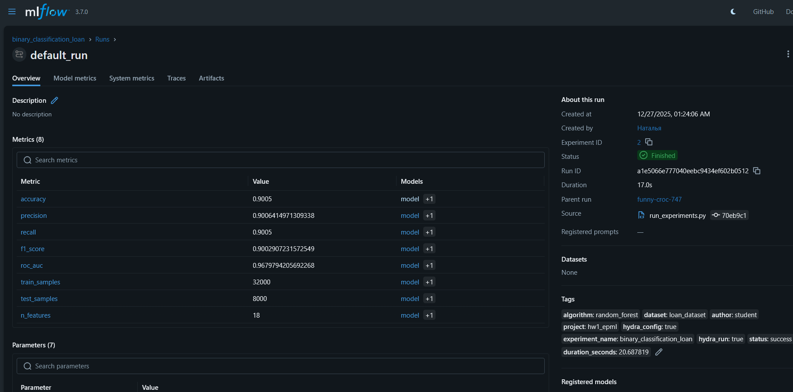
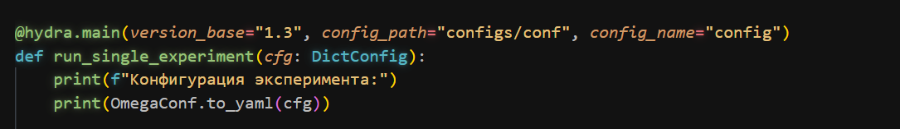
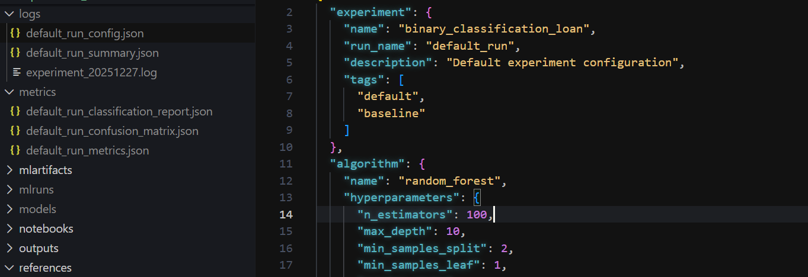
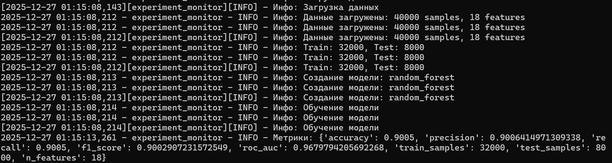

esaulvn_hw4_epml
==============================

# Настройка DVC Pipelines:

* DVC установлен и настроен
* Создан workflow для ML пайплайна с 4 этапами
    - подготовка данных
    - проведение эксперимента с Hydra
    - проведение всех экспериментов
    - оценка наилучшей модели на тестовых данных


* Настроeны зависимости между этапами через deps в dvc.yaml 
* Настроено кэширование в dvc.yaml, запустить параллельное выполение можно через

```
py -m poetry run src/utils/parallel_execution.py
```

# Настройка выбранного инструмента конфигураций - Hydra:

Настроен Hydra для управления конфигурациями, созданы конфигурации для разных алгоритмов, структура папки с конфигами выглядит так, конфиги разделены по компонентам (алгоритмы, данные, эксперименты):

    configs/conf/
    ├── config.yaml          
    ├── experiment/          
    │   └── default.yaml
    ├── algorithm/          
    │   ├── random_forest.yaml
    │   ├── logistic_regression.yaml
    │   ├── xgboost.yaml
    │   ├── svm.yaml
    │   └── knn.yaml
    ├── data/              
    │   └── default.yaml
    ├── mlflow/         
    │   └── default.yaml
    └── experiments/      
        └── all_experiments.yaml

* Для запуска эксперимента с Hydra 

```
py -m poetry run dvc repro run_single_experiment
```

* Поменять дефолтный эксперимент можно в configs/config.yaml, также можно запустить без dvc с параметром 
```
py -m poetry run run_experiments.py algorithm=svm
```

* Посмотреть на результаты выполнения можно в MLFlow


* Валидация конфигураций настроена через src\config\schema.py, реализована проверка через датаклассы, соответствие типам, значения по умолчанию и т.д.

# Интеграция и тестирование:

* В DVC настроены пути к файлам и параметры, Hydra интегрирована в run experiments

* Создана систему мониторинга экспериментов в src\monitoring\monitor.py
* Уведомления о результатах можно увидеть в командной строке, и в сохраненных артефактах




# Отчет о проделанной работе:

Создан отчет в формате Markdown