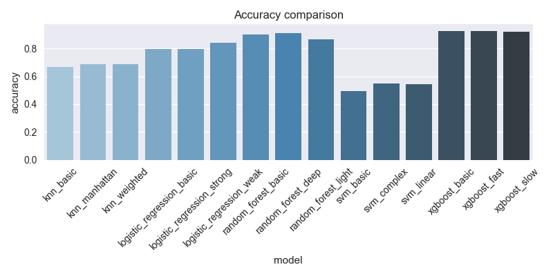
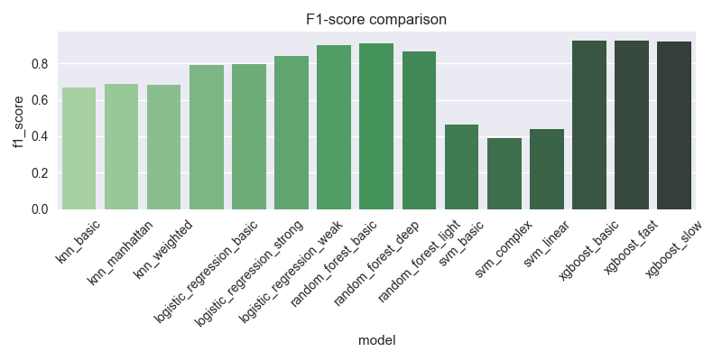

# Отчет об экспериментах

## Сравнительная таблица моделей

| model                      |   accuracy |   precision |   recall |   f1_score |   roc_auc |
|:---------------------------|-----------:|------------:|---------:|-----------:|----------:|
| knn_basic                  |     0.6685 |      0.6669 |   0.6685 |     0.6666 |    0.7128 |
| knn_manhattan              |     0.6871 |      0.6858 |   0.6871 |     0.6853 |    0.7372 |
| knn_weighted               |     0.6854 |      0.684  |   0.6854 |     0.6831 |    0.7357 |
| logistic_regression_basic  |     0.7951 |      0.7949 |   0.7951 |     0.7944 |    0.8762 |
| logistic_regression_strong |     0.7965 |      0.7962 |   0.7965 |     0.7959 |    0.8761 |
| logistic_regression_weak   |     0.8428 |      0.8426 |   0.8428 |     0.8425 |    0.9261 |
| random_forest_basic        |     0.9005 |      0.9006 |   0.9005 |     0.9003 |    0.968  |
| random_forest_deep         |     0.9109 |      0.9108 |   0.9109 |     0.9108 |    0.9734 |
| random_forest_light        |     0.8649 |      0.8667 |   0.8649 |     0.864  |    0.9444 |
| svm_basic                  |     0.4958 |      0.533  |   0.4958 |     0.4662 |    0.5376 |
| svm_complex                |     0.5505 |      0.3031 |   0.5505 |     0.3909 |    0.5    |
| svm_linear                 |     0.5455 |      0.5135 |   0.5455 |     0.4406 |    0.5233 |
| xgboost_basic              |     0.9276 |      0.9276 |   0.9276 |     0.9276 |    0.9835 |
| xgboost_fast               |     0.9248 |      0.9249 |   0.9248 |     0.9246 |    0.9823 |
| xgboost_slow               |     0.9235 |      0.9235 |   0.9235 |     0.9235 |    0.9825 |

## Визуализация результатов

